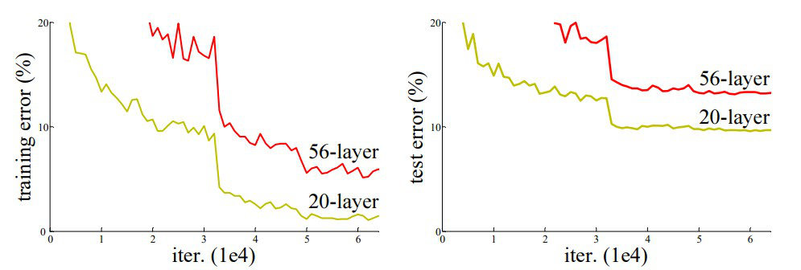

# Residual Networks (ResNet) 
 
 After the first CNN-based architecture (AlexNet) that win the ImageNet 2012 competition, Every subsequent winning architecture uses more layers in a deep neural network to reduce the error rate. This works for less number of layers, but when we increase the number of layers, there is a common problem in deep learning associated with that called the Vanishing/Exploding gradient. This causes the gradient to become 0 or too large. Thus when we increases number of layers, the training and test error rate also increases. 

 

 In the above plot, we can observe that a 56-layer CNN gives more error rate on both training and testing dataset than a 20-layer CNN architecture. After analyzing more on error rate the authors were able to reach conclusion that it is caused by vanishing/exploding gradient. 
ResNet, which was proposed in 2015 by researchers at Microsoft Research introduced a new architecture called Residual Network. 

Residual Network: In order to solve the problem of the vanishing/exploding gradient, this architecture introduced the concept called Residual Blocks. In this network, we use a technique called skip connections. The skip connection connects activations of a  layer to further layers by skipping some layers in between. This forms a residual block. Resnets are made by stacking these residual blocks together. 
The approach behind this network is instead of layers learning the underlying mapping, we allow the network to fit the residual mapping. So, instead of say H(x), initial mapping, let the network fit, 

    F(x) := H(x) - x which gives H(x) := F(x) + x. 

The advantage of adding this type of skip connection is that if any layer hurt the performance of architecture then it will be skipped by regularization. So, this results in training a very deep neural network without the problems caused by vanishing/exploding gradient.  The authors of the paper experimented on 100-1000 layers of the CIFAR-10 dataset. 
There is a similar approach called “highway networks”, these networks also use skip connection. Similar to LSTM these skip connections also use parametric gates. These gates determine how much information passes through the skip connection. This architecture however has not provided accuracy better than ResNet architecture. 

Network Architecture: This network uses a 34-layer plain network architecture inspired by VGG-19 in which then the shortcut connection is added. These shortcut connections then convert the architecture into a residual network. 

    pip install -r requirements.txt

Run [resnet.ipynb ](https://github.com/FreckledMe/GoogleNet/blob/main/resnet.ipynb)